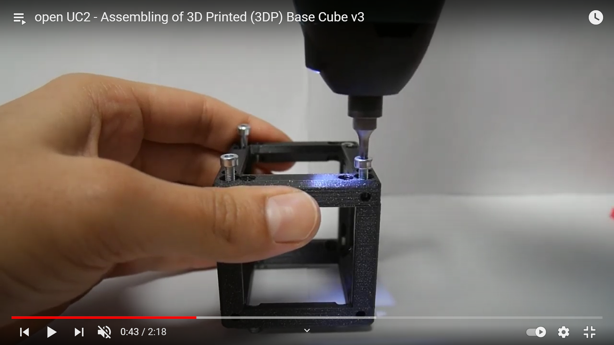

# BASE CUBE
This is the repository for the base cube design. The design-files can be found in the folder [INVENTOR](./INVENTOR).

<p align="center">

</p>

The base cube comes in two versions - **injection moulded (IM)** and **3D-printed (3DP)** that are fully compatible with each other. You can either print all the baseplates and cubes and assemble and connect them using screws and magnets, or you can use the IM cubes and baseplate puzzles that connect via the lego-like pins.

The IM cube is shown in the first picture. The two identical halves fit perfectly together and each of the two pinned sides of the cube fits to the baseplate.
<p align=center>

</p>

The 3D-printed cube is in the next picture. The body and the lid are held together by the M3 screws that attach to the magnets of the baseplate. Additionally, M5 screws are added to the position of the pins for better alignment precision.
<p align=center>

</p>

The 3D-printed baseplate puzzles are fully compatible with both types of cubes and with the IM puzzles. It is important to pay attention to calibration of your printer according to the guide in the [baseplate CAD page](../ASSEMBLY_Baseplate). There you also find general information on building a setup from Cubes and Baseplate puzzles.

## Parts

The basic building unit always consists of 3 components - two parts of a cube that close around an insert and a baseplate. The actual architecture of the Cube depends on the production method:

Parts|IM Cube | 3DP Cube
:---|:---|:---
-||
Baseplate| **The Baseplate puzzle (IM)** which serves as the skeleton of all setups. [More about baseplates.](../ASSEMBLY_Baseplate) | **The Baseplate puzzle (3DP)** which serves as the skeleton of all setups and where the ball magnets will be fed in. [More about baseplates.](../ASSEMBLY_Baseplate)
Building block| **The half-Cube** that is symmetrical and two of them form a Cube. Thanks to the IM production, the parts are very precise, so the halves are just pressed together and stay assembled. | **The Cube Body** where all the functions (i.e. Mirrors, LED's etc.) find their place - inserts that define the function of the cube are placed in the body before closing the lid.
-| The Cube has pins, eight on each of the two opposite sides, that connect the Cube to the Baseplate. | **The Lid** that closes the cube. It is attached by four M3 screws.
Additional parts|-| **Magnets** (5 mm diameter) are fed into the Baseplate and attach to the M3 screws of the Cube. [🢂](https://www.magnetmax.de/Neodym-Kugelmagnete/Magnetkugel-Kugelmagnet-O-5-0-mm-Neodym-vernickelt-N40-haelt-400-g::158.html)
-|-| **IMPORTANT: Not all screws are magnetic!** See the note below this table.
-|-| **M3 screws** (M3×12, galvanized steel) that hold the Body and Lid together, closing the Cube. They also attach the cube to the Baseplate via magnets. [🢂](https://eshop.wuerth.de/Zylinderschraube-mit-Innensechskant-SHR-ZYL-ISO4762-88-IS25-A2K-M3X12/00843%20%2012.sku/de/DE/EUR/)
-|-| **M5 screws** (M5×8) that replace the pins of the IM Cube. They make the alignment more precise and the connection between the Cube and the Baseplate more stable. [🢂](https://eshop.wuerth.de/Produktkategorien/ISO-4026-Stahl-45H-verzinkt/14013511052004.cyid/1401.cgid/de/DE/EUR/?CatalogCategoryRef=14013511052004%40WuerthGroup-Wuerth-1401&SelectedFilterAttribut=%255B%257B%2522name%2522%253A%2522AT_ThreadTypeXNominalDiameter%2522%252C%2522value%2522%253A%255B%2522M5%2522%255D%252C%2522title%2522%253A%2522Gewindeart%2520x%2520Nenndurchmesser%2522%257D%252C%257B%2522name%2522%253A%2522AT_Length%2522%252C%2522value%2522%253A%255B%25228%2520mm%2522%255D%252C%2522title%2522%253A%2522L%25C3%25A4nge%2522%257D%255D)


**IMPORTANT: Not all screws are magnetic!**  
It is very important to buy the right screws - the M3 screws need to attach to the magnets and therefore it is crucial that they are magnetic. STAINLESS STEEL IS GENERALLY NOT A MAGNETIC MATERIAL. THE SCREWS HAVE TO BE MADE OF GALVANIZED STEEL. If you want to know more about why not all steel is magnetic you can read about it [here](https://monnigindustry.com/2020/12/23/is-galvanized-steel-magnetic-why-or-why-not/). Unfortunately, the DIN 912 / ISO 4762 screws that we propose can be made of both and you can frequently find both at the same vendor.    
The take-home message is: **The M3 screws have be made of galvanized steel and never stainless steel!**
Check out the [RESOURCES](../../TUTORIALS/RESOURCES/Resources_Mechanics.md) for sources of the right screws.

*We are working on making the IM Cubes and Puzzles available for sale, but we are not able to offer a 'BUY' button yet. If you are interested in buying some components, contact us via email info@useetoo.org*

The function which fits into the cube is not necessarily bound to optics. It can be anything!
The function is defined by the insert and all our insert are in the respective module folder in [CAD](../)

<p align="center">

</p>

The details about the size and other properties of the basic building block is found in the [Modular Developer Kit (MDK)](../../MDK).

### Devices features:

* Click-Mount via pins (IM) or Ball-Magnets/Screws (3DP)
* Fill in whatever function you want
* Modularized design
* Low-cost production
* Very precise
* Open-Source
* Mount it in all possible directions

## [3D Printing](./STL)

## Assembly
([TUT02 of TUTORIALS](../../TUTORIALS))

### Assembly Video Tutorial
#### IM Cube
[](https://www.youtube.com/watch?v=y1q-O_CigGY&ab_channel=openUC2)

#### 3DP Cube
[](https://www.youtube.com/watch?v=Rjwojkbwct4&t=1s&ab_channel=openUC2)

#### Watch how much time the IM cubes can save!
[](https://www.youtube.com/watch?v=M_oqieogAOo&feature=youtu.be&ab_channel=openUC2)


## Assembly Tutorial with images - IM Cube

1. All parts for this model
<p align="center">

</p>

2. The two halves of the cube fit together without further screws or other parts. Ideally, take each half in one hand and align the ends of the edges of one part into the holes on the other one. Make sure that none of the is sticking in a wrong direction. Then press them firmly together.
<p align="center">


</p>

3. Done!
<p align="center">

</p>

## Assembly Tutorial with images - 3DP Cube

1. All parts for this model
<p align="center">

</p>

2. When building a sandwich-like setup, you will need to connect the cube to a baseplate on both sides.
If you're going to build a flat setup, you may skip to step #5.  
Insert the M3×8 screws into the Cube-Body.
<p align="center">


</p>

3. Insert the M5×8 screws into the Cube-Body. In our experience, three are optimal. Distribute the over the area, don't put them all next to each other.
<p align="center">


</p>

4. Make sure they are not screwed in too much, otherwise they might get in the way of the insert inside the cube. This can be adjusted later.
<p align="center">

</p>

5. Insert the M5×8 screws into the Cube-Body. In our experience, three are optimal. Distribute the over the area, don't put them all next to each other. Make sure they are not screwed in too much, otherwise they might get in the way of the insert inside the cube. This can be adjusted later.
<p align="center">


</p>

6. Close the cube with the lid and attach it using four M3×12 screws. Place an insert inside before this.
<p align="center">


</p>

7. Done - the assembled cube has screws and the M5 pin-screws on both sides.
<p align="center">

</p>

### This was TUT02 of [TUTORIALS](../../../TUTORIALS). Continue to [TUT03](../ASSEMBLY_CUBE_Lens/TUT03)!

#### Combine IM and 3DP baseplates and Cubes
[](https://www.youtube.com/watch?v=J6wY9sDKyKg&ab_channel=openUC2)


## Electronics
The Arduino/ESP32 can be introduced with hot-glue or a rubber band, for parts with motors or LEDs. Find out more in the [ELECTRONICS](../../ELECTRONICS) section.

## CAD Design
Please also see the Module developer kit ([MDK](../../MDK)) for further design instructions on how you should adapt to the UC2 cubes.

## OpenSCAD files
Open-Source also means, that one should be able to modify the files with open-source software. Therefore we provide the basic cube as an ```.scad``` file in the [OPENSCAD](./OPENSCAD) folder.  The Inventor files will follow soon!

## Tutorial on how to design an insert in Inventor
Find the tutorial in the [INVENTOR](./INVENTOR) folder.

## Participation
We are eager to see your results! Feel free to file a pull-request or share it via mail or [@openUC2 on Twitter](https://twitter.com/openUC2) .
